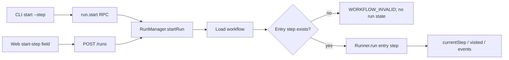

# Start Workflow from Step Design

**Spec**: `.specs/features/start-workflow-from-step/spec.md`
**Status**: Approved by user on 2026-07-01

---

## Architecture Approach

### Considered approaches

| Approach | Trade-offs | Decision |
| -------- | ---------- | -------- |
| Extend the existing start contract with optional `startStepId`, validate in `RunManager`, and pass it to `Runner.run` | Smallest change; one validation authority; preserves all existing launch and persistence behavior | **Selected** |
| Add separate `/runs/from-step` and `run.startFromStep` operations | Explicit but duplicates start orchestration, error mapping, limits, and clients | Rejected |
| Persist a configured start step in workflow or a new run-snapshot field | Makes a per-launch choice look permanent and duplicates `currentStepId`/`visitedStepIds` evidence | Rejected |

The selected approach was already described in the confirmed specification/context: both HTTP and RPC accept the same optional field, `RunManager` validates it against the loaded workflow before allocating or persisting a run, and the existing runner receives the resolved entry ID.



No `.specs/STATE.md` exists, so there are no active project-level decisions to reconcile. No confirmed project lessons exist.

---

## Code Reuse Analysis

| Existing component | Location | Reuse |
| ------------------ | -------- | ----- |
| Arbitrary runner entry | `src/domain/runner.ts` | Call the existing `run(startStepId, startInbound)` API; no domain algorithm change. |
| Workflow ID lookup | `src/domain/workflow.ts` | Use `hasStep` and `firstStepId` as the validation/default authority. |
| Workflow-invalid mapping | `src/app/api/error-map.ts`, `src/infra/daemon/handlers/run-start.ts` | Throw `WorkflowConfigError` so HTTP and RPC keep their established error contracts. |
| Start request pipeline | `src/app/api/routes/start-run.ts`, `src/infra/daemon/protocol.ts` | Extend, do not fork, the existing start operations. |
| CLI flag conventions | `src/app/cli.ts`, `src/app/commands/start.ts` | Mirror `--branch` parsing and conditional RPC payload shaping. |
| Scoped workflow queries | `web/src/features/workflows/useWorkflow.ts` | Load the selected catalog workflow with the existing scope-aware query and cache key. |
| Workflow name helper | `web/src/features/workflows/workflowNames.ts` | Convert list filename to the bare API route name. |
| Shadcn form controls | `web/src/components/ui/select.tsx`, `input.tsx` | Preserve Radix keyboard/focus semantics and theme tokens. |

Context7 confirmed that TanStack Query v5 supports a conditional `enabled` option and requires query-key dependencies to include the selected identifier. The existing `useWorkflow` hook already follows that pattern.

---

## Components and Interfaces

### Run Manager Entry-Step Policy

- **Location**: `src/infra/daemon/run-manager.ts`
- **Interface**: `startRun(workflowPath, cwd, branch?, initialPrompt?, startStepId?)`
- Load the workflow, resolve `entryStepId = startStepId === undefined ? workflow.firstStepId() : asStepId(startStepId)`, and reject a missing exact ID with `WorkflowConfigError` before run ID allocation, registry reservation, persistence, event log, MCP server, or worktree mutation.
- Launch with the resolved ID and preserve `user-request` framing for an optional prompt.

### RPC and HTTP Adapters

- **Locations**: `src/infra/daemon/protocol.ts`, `src/infra/daemon/handlers/run-start.ts`, `src/app/api/schema.ts`, `src/app/api/routes/start-run.ts`
- Add optional non-empty `startStepId: string` at both typed boundaries and forward it unchanged to the manager.
- Existing `WorkflowConfigError` mapping remains the only public error conversion.

### Terminal Launch Adapter

- **Locations**: `src/app/cli.ts`, `src/app/commands/start.ts`
- Add `--step <id>` and `--step=<id>` parsing, help copy, and conditional `startStepId` in the RPC payload.
- Missing/empty values fail parsing before daemon connection. Attach/detach selection is untouched.

### Web Start-Step Field

- **Locations**: `web/src/features/start-run/StartStepField.tsx`, `StartRunForm.tsx`
- For a selected catalog workflow, query its document by bare name and scope, validate the minimal `{ steps: [{ id }] }` shape at the boundary, and render `Default (first step)` plus IDs in file order.
- For manual paths, render an optional text input.
- Store one local `startStepId` string. Reset it in the workflow/manual-path event handlers; do not add an effect.
- Omit the request field when blank and preserve state on mutation failure.

### Web Wire Contract

- **Locations**: `web/src/lib/api/types.ts`, `web/src/lib/api/client.ts`
- Extend `StartRunRequest` with optional `startStepId`; `startRun` needs no algorithm change because it already serializes the request object.

---

## Data Models

```typescript
interface StartRunRequest {
  workflowPath: string
  cwd: string
  branch?: string
  initialPrompt?: string
  startStepId?: string
}
```

No new persisted field is introduced. Existing initial boundary persistence records the selected ID as `currentStepId`; the runner then appends it to `visitedStepIds` when execution begins.

---

## Error Handling Strategy

| Scenario | Handling | User impact |
| -------- | -------- | ----------- |
| Empty CLI flag or HTTP field | Parser/Zod boundary rejects | Usage or HTTP 400; manager is not called. |
| Exact ID absent from workflow | `RunManager` throws `WorkflowConfigError` before mutation | RPC/HTTP `WORKFLOW_INVALID`, requested ID named. |
| Selected workflow detail loading | Query exposes loading/error state | Default entry remains available; manual-path flow remains available. |
| Workflow document has unusable step shape | Minimal Zod parse fails | Step selector reports unavailable instead of asserting/casting unknown data. |
| Start mutation fails | Existing mutation error rendering | Values remain; no navigation. |

---

## Risks & Concerns

| Concern | Location | Impact | Mitigation |
| ------- | -------- | ------ | ---------- |
| `startRun` has positional optional arguments | `src/infra/daemon/run-manager.ts` | A fifth argument can be forwarded in the wrong position. | Update every typed adapter and assert exact forwarded values in adapter tests; do not perform a broad signature refactor in this feature. |
| Workflow detail payload is `unknown` | `web/src/lib/api/types.ts` | A cast could make malformed data crash the selector. | Validate the minimal step-list shape with Zod at the UI boundary. |
| Start form and its test file are already large | `web/src/features/start-run/StartRunForm.tsx`, `StartRunForm.test.tsx` | Inline selector logic would increase coupling and test complexity. | Put rendering/parsing in focused `StartStepField` and keep form integration tests limited to user flow. |
| Start manager owns resource reservation sequencing | `src/infra/daemon/run-manager.ts` | Late validation could leave partial state. | Resolve and validate the entry immediately after workflow load and before ID allocation/reservation. |

---

## Tech Decisions

| Decision | Choice | Rationale |
| -------- | ------ | --------- |
| Validation authority | `RunManager` after workflow load | Both HTTP and RPC converge there; avoids inconsistent adapter validation. |
| Web reset behavior | Reset in selection/path event handlers | User action is the cause; React effects would add an unnecessary synchronization pass. |
| Web server state | Existing `useWorkflow` TanStack query | Scope/name are already encoded in the query key and conditional loading is established. |
| Persistence | No new snapshot field | Existing current/visited/event state fully expresses the actual entry. |
| UI primitives | Existing shadcn Select/Input | Retains keyboard accessibility, focus management, and theme tokens. |

All decisions are feature-local; no project-wide `STATE.md` decision is required.
